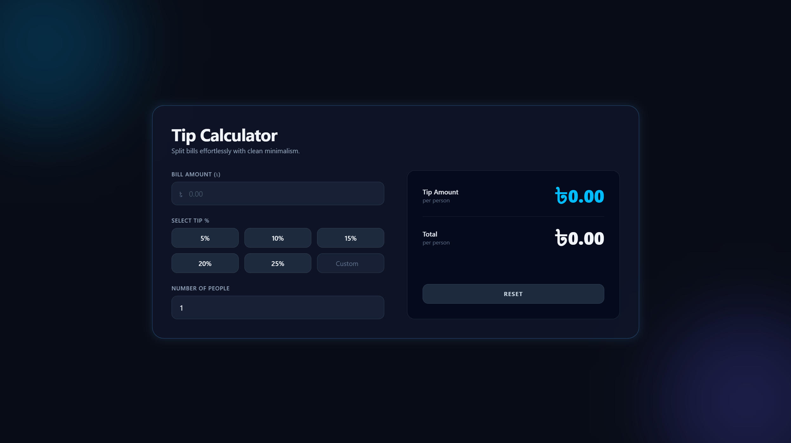

# 💸 Tip Calculator

**Created:** August 17, 2026  
**Last Updated:** August 18, 2026

🔗 **Live Demo:** [Click Here 👆](https://tip-calculator-six-brown.vercel.app/)

A fast and responsive web application built with **HTML5**, **CSS3**, **Tailwind CSS**, and **vanilla JavaScript** to calculate tips in real-time. The project features a premium **Minimalism UI** user interface, combining clean minimalist elements with smooth, dynamic animations and layered depth.

---



---

## ✨ Features

- 🎨 **Modern Dark Aesthetics:** A premium, eye-catching UI featuring a deep dark mode palette, smooth neon glow effects, and a highly polished layout.
- 🇧🇩 **Localized Currency Support:** Seamlessly integrated with the Bangladeshi Taka (৳) symbol, tailored perfectly for local usage and a personalized feel.
- ⚡ **Dynamic Real-Time Calculation:** Automatically evaluates and updates the tip amount and total bill per person instantly as the user types or selects options.
- 🎛️ **Flexible Tip Selection:** Offers predefined tip percentage buttons (5% to 25%) alongside a 'Custom' input option for complete user control.
- 👥 **Smart Bill Splitting:** Features an intuitive number of people selector to split both the base bill and the calculated tip evenly among friends or groups.
- 🚀 **Zero-Dependency Stack:** Engineered for maximum performance and lightning-fast loading using semantic HTML5, utility-first Tailwind CSS classes, and native vanilla JavaScript.

---

## 🛠️ Tech Stack

| Technology           | Purpose                 |
| -------------------- | ----------------------- |
| HTML5                | Page structure          |
| CSS3                 | CSS animations          |
| Tailwind CSS         | Styling and layout      |
| JavaScript (Vanilla) | Logic and interactivity |

---

## 📁 Project Structure

```text
tip-calculator/
├── 📁 assets/               # Static assets
│   └── 📁 images/           # Images and icons
│       └── 📄 favicon.png   # Favicons on website
│       └── 📄 preview.png   # Project preview screenshot
├── 📁 node_modules/         # Dependencies managed by npm
├── 📁 src/                  # Application source logic
│   └── 📄 main.js           # JavaScript logic
│   └── 📄 style.css         # Tailwind CSS import and CSS animations
├── 📄 README.md             # Project documentation
├── 📄 index.html            # Entry HTML page
├── 📄 package-lock.json     # Locked npm package versions
├── 📄 package.json          # Node project metadata and scripts
└── 📄 vite.config.ts        # Vite bundler configuration
```

---

## ⚙️ How It Works

1. **Data Collection & Input Validation:** When a user types the bill amount, selects a tip percentage, or enters the number of people, the JavaScript engine listens for real-time input events and validates that the values are positive numbers.
2. **Mathematical Computation:** The script computes the total tip amount based on the chosen percentage, adds it to the base bill, and divides both figures evenly by the number of people to calculate the precise per-person breakdown.
3. **Dynamic DOM Rendering:** The application instantly updates the UI to display the calculated tip and total amounts in Bangladeshi Taka (৳), while managing the active states of selection buttons and the reset button dynamically.

---

## ⚙️ Customization

- 🎨 **Modify Glow & Theme Colors:** Open the main container file to tweak the Tailwind CSS background classes and shadow glow effects (e.g., modifying `shadow-[0_0_20px_rgba(...)]`) to match your preferred dark or neon color scheme.
- 🇧🇩 **Change Currency Symbol:** Open the JavaScript file and locate the UI rendering logic to replace the Bangladeshi Taka symbol (`৳`) with Dollar (`$`), Euro (`€`), or any other local currency sign of your choice.
- 🎛️ **Adjust Predefined Tip Percentages:** Locate the button container in the HTML structure to easily change the default tip values (like 5%, 10%, etc.) to any custom percentage steps that fit your local dining standards.

---

<div align="center">

_"Every great app starts with someone brave enough to click `+` first."_

⭐ **If this counter counted anything for you, give the repo a star!** ⭐

</div>
